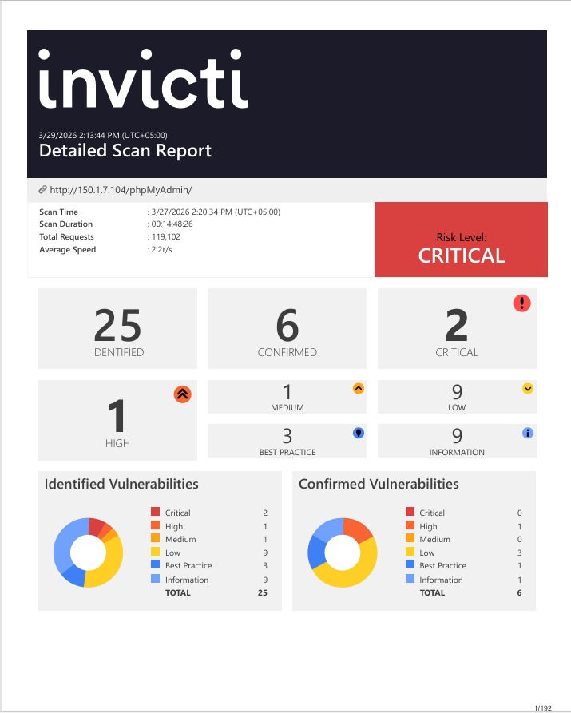
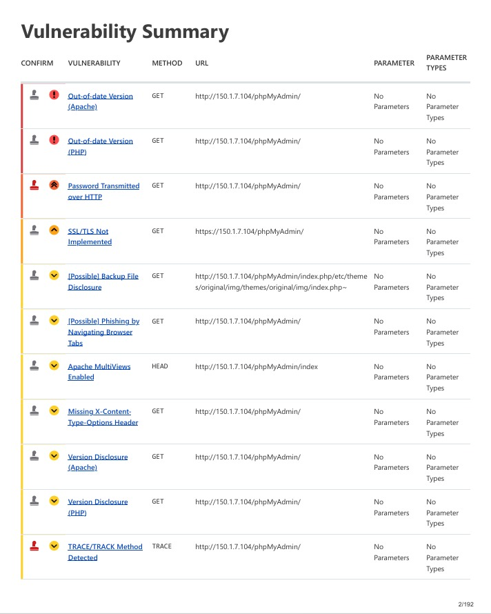
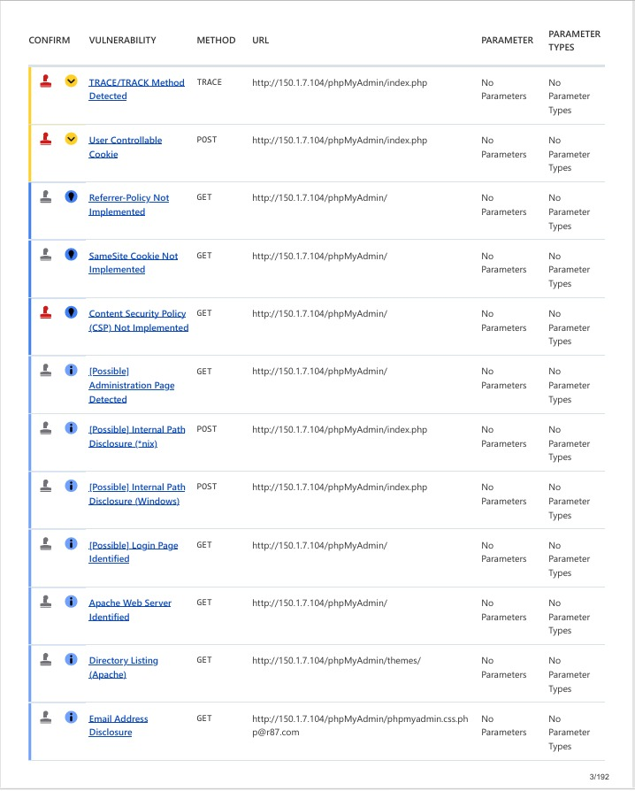
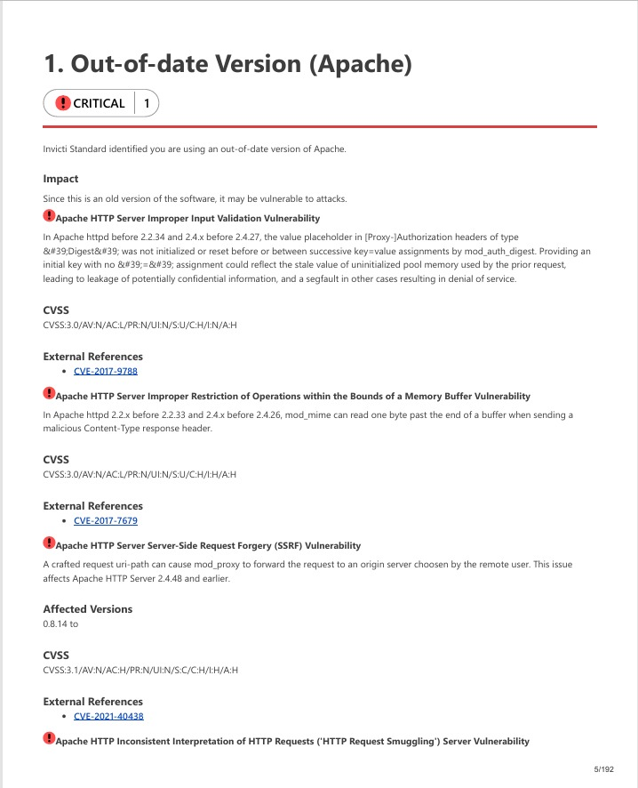
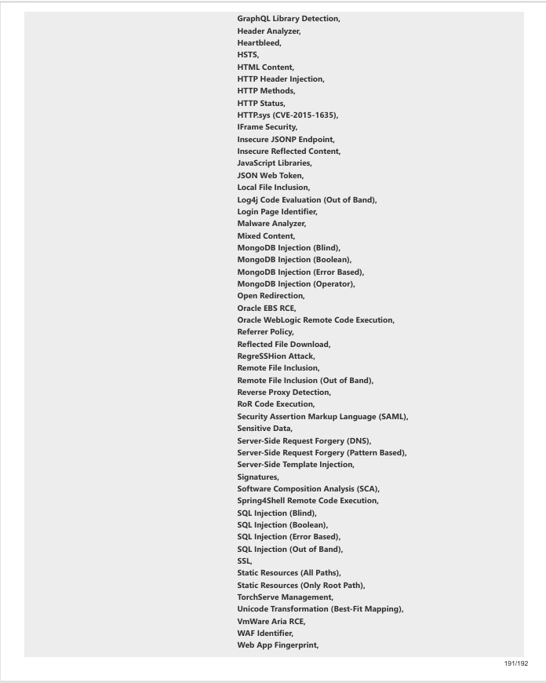
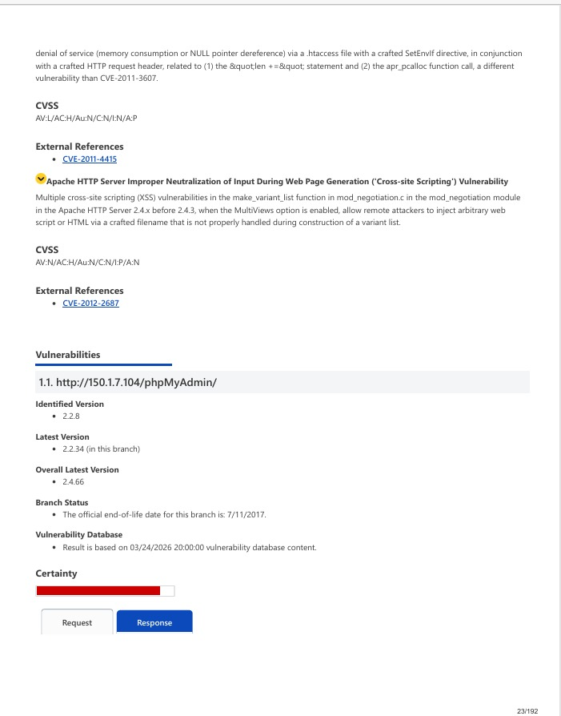

# 🔐 Web Application Security Assessment

> A professional web application vulnerability assessment conducted using **Invicti Standard v25.2** — an enterprise-grade Dynamic Application Security Testing (DAST) scanner used by security teams worldwide. The assessment targeted a phpMyAdmin installation, producing a 192-page detailed scan report across 119,102 HTTP requests over approximately 15 hours of scanning.

---

## 📋 Assessment Overview

| Detail | Value |
|--------|-------|
| **Tool** | Invicti Standard v25.2 |
| **Target** | phpMyAdmin |
| **Scan Date** | March 27, 2026 |
| **Scan Duration** | 14 hours 48 minutes |
| **Total Requests** | 119,102 |
| **Average Speed** | 2.2 requests/second |
| **Overall Risk Level** | 🔴 CRITICAL |
| **Report Pages** | 192 |

---
## 📊 Vulnerability Summary

The dashboard above represents the complete findings from the Invicti DAST scan. The overall risk level was classified as **CRITICAL** — the highest possible severity rating — driven by two confirmed critical vulnerabilities in the target's Apache and PHP installations. 

The distinction between **Identified** and **Confirmed** vulnerabilities is significant from an analyst perspective. Identified vulnerabilities are findings where Invicti detected indicators of a potential issue but could not automatically exploit them to confirm exploitability. Confirmed vulnerabilities are those where Invicti's proof-based scanning engine successfully demonstrated the vulnerability is genuinely exploitable — not a false positive. A confirmed finding requires immediate remediation priority over an identified one.

### Findings Breakdown

| Severity | Identified | Confirmed |
|----------|-----------|-----------|
| 🔴 Critical | 2 | 0 |
| 🟠 High | 1 | 1 |
| 🟡 Medium | 1 | 0 |
| 🟡 Low | 9 | 3 |
| 🔵 Best Practice | 3 | 1 |
| ℹ️ Information | 9 | 1 |
| **Total** | **25** | **6** |

---

## 🗂️ Identified Vulnerabilities

The vulnerability summary table above lists the first set of findings organized by severity. The two **Critical** findings — Out-of-date Apache and Out-of-date PHP — appear at the top, flagged with red critical icons. These are the most dangerous findings in the assessment because outdated server software exposes the target to dozens of publicly known CVEs with available exploit code.

The **High** severity finding — Password Transmitted over HTTP — is particularly dangerous in a phpMyAdmin context because it means database administrator credentials are being sent in plaintext over the network, making them trivially interceptable via a simple packet capture on the same network segment.

**SSL/TLS Not Implemented** compounds this problem significantly — without HTTPS enforced, every session including authentication tokens and query results travels unencrypted. These two findings together create a scenario where an attacker on the same network can capture database credentials and session tokens with zero technical sophistication required.

The second page of the vulnerability summary reveals the remaining findings. Several entries here are worth highlighting from a security hardening perspective:

- **Content Security Policy (CSP) Not Implemented** — leaves the application vulnerable to cross-site scripting attacks that could otherwise be mitigated at the browser level
- **User Controllable Cookie** — indicates session cookie attributes are not properly secured, potentially allowing cookie theft or manipulation
- **SameSite Cookie Not Implemented** — exposes the application to Cross-Site Request Forgery (CSRF) attacks
- **Referrer-Policy Not Implemented** — allows sensitive URL information to leak to third-party sites via the HTTP Referer header
- **Email Address Disclosure** — the scanner identified a real email address embedded in the application response, providing attackers with a social engineering target

---

## 🔴 Critical Finding: Out-of-date Apache

This page from the full report details the most impactful finding of the assessment — an **out-of-date Apache HTTP Server** installation carrying a **CRITICAL** severity classification. This single finding maps to dozens of publicly documented CVEs, several of which have publicly available exploit code making them trivially exploitable by even low-skilled attackers.

### Why This is Critical

Running an outdated Apache version is not merely a theoretical risk — it means the server is definitively vulnerable to attacks that have already been documented, analyzed, and weaponized by the security community. Unlike zero-day vulnerabilities where no patch exists, these CVEs all have available fixes. The presence of an unpatched server means the administrator has either not prioritized patching or is unaware of the exposure.

### CVEs Identified in This Finding

| CVE | Vulnerability Type | CVSS Score |
|-----|-------------------|------------|
| CVE-2017-9788 | Improper Input Validation — mod_auth_digest memory leak | 3.0 |
| CVE-2017-7679 | Buffer Over-read — mod_mime Content-Type header | 3.0 |
| CVE-2021-40438 | Server-Side Request Forgery (SSRF) — mod_proxy | 3.1 |
| CVE-2022-22720 | HTTP Request Smuggling — connection handling | 3.1 |
| CVE-2021-44790 | Buffer Overflow — mod_lua multipart parser | 3.1 |
| CVE-2022-31813 | Authentication Bypass — X-Forwarded headers | 3.1 |
| CVE-2022-28615 | Integer Overflow or Wraparound | 3.1 |

The SSRF vulnerability (CVE-2021-40438) is particularly dangerous — it allows an attacker to craft a malicious request that causes the server's mod_proxy to forward requests to an attacker-controlled origin server. This can be used to bypass firewall rules, access internal services, and perform server-side port scanning of the internal network.

### Remediation

- Immediately upgrade Apache to the latest stable version
- Implement a patch management process to ensure server software stays current
- Monitor Apache security advisories at httpd.apache.org/security

---

## 📑 Vulnerability Classification Framework

The classification page above demonstrates the depth of Invicti's reporting — each vulnerability is mapped across multiple industry-standard security frameworks simultaneously. This cross-framework mapping is essential for enterprise security teams who must report findings against specific compliance requirements.

| Framework | Mapping | Significance |
|-----------|---------|--------------|
| **OWASP Top Ten 2021** | A05 | Security Misconfiguration — most common web vulnerability category |
| **OWASP Top Ten 2017** | A6 | Security Misconfiguration |
| **NIST SP 800-53** | AC-22 | Access Control — publicly accessible content |
| **ISO 27001** | A.14.2.5 | Secure system engineering principles |
| **CWE** | 205 | Observable behavioral discrepancy |
| **DISA STIG** | V-16814 | Defense Information Systems Agency standard |
| **ASVS 4.0** | 14.3.3 | Application Security Verification Standard |
| **OWASP API Top 10 2023** | API8 | Security Misconfiguration |

The CVSS 3.0 scores shown (Base: 5.3 Medium, Temporal: 5.1 Medium, Environmental: 5.1 Medium) represent a standardized severity rating that factors in exploitability, impact, and environmental context. The temporal score being slightly lower than the base score reflects the availability of patches — reducing the urgency slightly compared to an unpatched zero-day.

---

## ⚙️ Scan Configuration

The scan detail page reveals the comprehensive coverage of the Invicti assessment. The enabled security checks list demonstrates that this was a full-spectrum DAST scan — not a targeted or limited assessment. Key checks included:

- **SQL Injection** (Boolean, Blind, Error-based, Out-of-band) — all four major SQLi detection methods
- **Cross-site Scripting** (Reflected, Blind, DOM-based)
- **Server-Side Request Forgery** (DNS-based, Pattern-based)
- **Command Injection** (Regular and Blind)
- **Remote Code Execution** — Apache Struts, Spring4Shell, Log4j, Oracle WebLogic
- **Local and Remote File Inclusion**
- **XML External Entity (XXE)** injection
- **JWT Security** — JSON Web Token validation
- **Software Composition Analysis (SCA)** — third-party library vulnerabilities
- **SSL/TLS configuration** — certificate and protocol weaknesses
- **HTTP Methods** — dangerous method detection (TRACE/TRACK)

The breadth of checks confirms this assessment provides comprehensive coverage equivalent to a professional penetration test's automated scanning phase.

---

## 🛠️ About Invicti

**Invicti Standard** is an enterprise-grade Dynamic Application Security Testing (DAST) platform used by security teams at organizations including NASA, the US Army, and Fortune 500 companies. Unlike open-source scanners, Invicti uses **proof-based scanning** — it doesn't just identify potential vulnerabilities, it automatically generates proof of exploitability where possible, dramatically reducing false positives that plague other scanning tools.

Key differentiators from tools like OWASP ZAP or Nikto:
- Proof-based scanning confirms real exploitability vs theoretical risk
- JavaScript rendering engine handles modern React/Vue/Angular applications
- Authenticated scanning crawls behind login walls
- Enterprise reporting with compliance framework mapping
- Significantly lower false positive rate than open-source alternatives

---

## ⚠️ Legal & Ethical Disclaimer

This assessment was conducted exclusively on:
- A **personally owned and controlled** isolated home lab environment
- A **phpMyAdmin installation** deployed specifically for security testing purposes
- With **no connection** to any production systems or third-party infrastructure

**Conducting unauthorized vulnerability scanning against systems you do not own is illegal under computer crime laws in most jurisdictions. All testing documented here was performed in a controlled lab environment for educational and skill development purposes only.**

---

## 👩‍💻 Author

**Ayesha** | Cybersecurity Practitioner | CCNA | CCNP | CEH

---

*Part of a hands-on cybersecurity portfolio demonstrating practical web application security assessment skills using industry-standard commercial tooling.*
